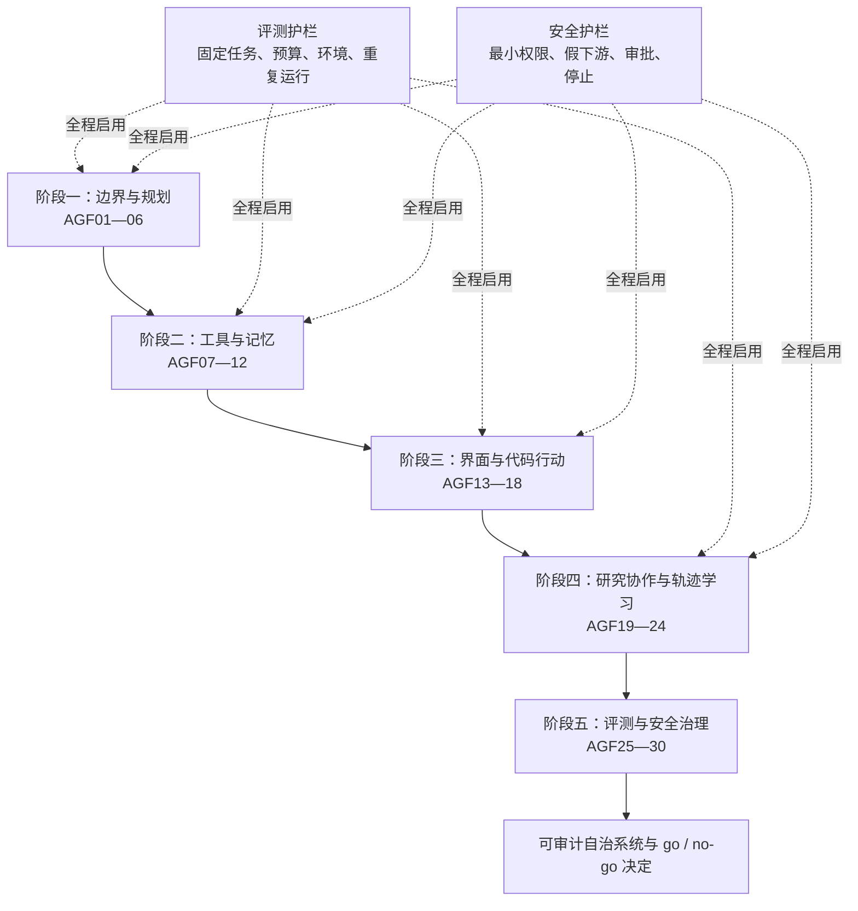

# 三年路线与 Agent 知识图谱

> 这张路线图负责安排顺序和取舍，不承担论文收藏。证据检索截止 2026-09-03；新增材料先进入证据库，只有真正改变学习判断时才进入正文。

Agent 的知识很容易按热词排列：规划、记忆、MCP、多 Agent、RL。这样的目录看起来丰富，却没有回答先修关系。这里改用系统能力的生成顺序：先界定谁能行动，再让行动读取真实反馈；先保证工具与状态可控，再扩大到 GUI 和代码；先建立同预算基线，最后才讨论协作和学习。评测与安全从第一天约束实验，在第五阶段集中成为发布决策方法。

## 一张图看清主线与两条护栏



图中的虚线很重要。第九、十章不是评测与安全第一次出现的地方，而是你第一次系统地解释它们、测量它们并决定发布的地方。前八章的写操作都受核心课程已有的权限网关约束，使用可复位环境；否则学习顺序会形成“先给高权限，最后才学保护”的危险循环。

## 五个阶段各自解决什么

| 阶段 | 学习节点 | 新增能力 | 主要产物 | 晋级证据 |
|---|---|---|---|---|
| 一：系统边界与可验证推理 | AGF01—06 | 在 single-call、workflow 与 Agent 之间选择；按反馈重规划 | 复杂度 ADR、运行契约、计划与恢复表 | 同任务同预算对照；超时、旧观察和证据不足时能正确停止 |
| 二：工具协议与长时状态 | AGF07—12 | 类型化工具、MCP 生命周期、记忆写入/召回/修订/遗忘 | 工具合同、状态差分、记忆策略与攻击集 | 重试无重复副作用；跨租户、伪造授权和过期记忆被拒绝 |
| 三：Computer use 与 Coding | AGF13—18 | 在 GUI 和代码仓库中观察、行动、验证 | 可复位桌面 harness、最小补丁与测试证据 | 动作前有风险门禁，动作后由环境验收；坏补丁不得合并 |
| 四：Research、多 Agent 与学习 | AGF19—24 | 证据并行、任务分工、轨迹归因与受控更新 | claim—evidence 账本、拓扑对照、held-out 回归 | 复杂方案在同预算下有净收益，且增益不是 Judge 或重复工作造成 |
| 五：因果评测与安全治理 | AGF25—30 | 拆开模型/scaffold/环境噪声；限制不可信内容影响高权限动作 | 分层实验卡、威胁模型、能力令牌与发布决定 | 方差、Judge 偏差、越权、注入、恢复和回滚都有可重放证据 |

每个阶段最后都有一次迁移验收。迁移任务会换业务对象，保留知识关系。例如在退款系统学会“未知结果先对账”，总结页可能要求你把它迁移到费用报销或内容发布。若只能复述原案例，阶段尚未完成。

## 129 个标准回合，但不把周数当完成证据

路线统一按每回合 45 分钟核算，共 129 回合 / 96 小时 45 分钟。每章标注已包含局部环境调整、运行、故障分析和报告；下表只另列跨介质的环境准备与至少 7 天后的延时复测。按每周 5～6 回合约需 22～26 周，工作繁忙时可以继续拉长，不能因为日历到了就跳过出口。

| 阶段 | 正文章节 | 阶段迁移 | 环境准备与延时复测 | 合计 | 最小结果 |
|---|---:|---:|---:|---:|---|
| 一 | 14 | 7 | 环境 1 ＋ 延时复测 1 | 23 | 三种复杂度基线；一次超时恢复与一次正确拒绝 |
| 二 | 14 | 7 | 延时复测 1 | 22 | 假工具状态机；写入/召回/冲突/删除四类记忆实验 |
| 三 | 13 | 6 | GUI/仓库环境 1 ＋ 延时复测 1 | 21 | 可复位 GUI 任务；一个有测试、审阅与拒绝合并路径的补丁 |
| 四 | 21 | 8 | 延时复测 1 | 30 | 单/多 Agent 同预算对照；离线轨迹归因与 held-out 回归 |
| 五 | 21 | 10 | 评测/红队环境 1 ＋ 延时复测 1 | 33 | 方差与消融报告；红队、能力令牌、回滚和 go / no-go 决定 |
| **全路线** | **83** | **38** | **8** | **129 回合 / 96 小时 45 分钟** | 一份可重放的自治证据包 |

每组回合仍按机制预测、最小对照、变式/故障和证据复算推进。延时复测独立计数，因为即时记住答案不等于能在另一日期迁移。论文阅读不单独制造额外回合：材料应服务当前决策，而不是让学习停在摘要收藏。

## 三条可裁剪支路

完整路线适合想构建通用 Agent 系统的人。已有明确目标时可以裁剪，但必须保留共同前置。

### 网页与桌面自动化

先完成阶段一、阶段二，再学第 5 章，随后可以通过“界面候选交接”直接进入第 9、10 章；第 6—8 章可暂缓。不能裁掉工具权限、环境复位、状态差分和人工接管。交给第 9 章的等价材料至少包括 GUI/业务对象双层环境快照、任务总体、基线与候选唯一差异、逐任务终态、禁止差分、成本、权限、未知结果、回退对象和完整性收据。它不需要伪造第 7、8 章的研究账本或训练快照。

### Coding agent

完成阶段一后，至少补第 3 章的工具合同，再进入第 6 章。若 Agent 只生成补丁、不自行合并，可以降低写权限，但不能省掉仓库版本、测试环境、最小 diff 和审阅证据。多 Agent 代码团队仍需先完成单 Agent / Agentless 基线。要直接进入第 9 章，交接包用仓库 commit、任务/测试总体、基线与候选 diff、命令和退出码、隐藏回归、沙箱边界、合并权限与回退 commit 替代学习候选材料。

### Deep Research 与多 Agent

完成阶段一、阶段二的只读工具与记忆边界（AGF01—12），即可进入第 7 章；Computer use 与 Coding 只是相关任务的推荐前置。若只是希望扩大搜索覆盖，先用固定并行工作流；只有子问题可分离、合并规则明确、重复成本可测时，多 Agent 才进入候选。研究系统可以用 claim—evidence ledger、来源祖先、冲突/未知项、任务总体、同预算逐任务结果、只读权限和回退方案作为等价交接，随后直接进入第 9、10 章；只有想让系统从轨迹学习时，才必须先完成第 8 章并补交训练快照、数据分区、候选父链与 held-out 回归。

三条支路共享的是第 9 章的测量合同，不是同一种候选制品。评测入口按 `candidate_type` 选择必填字段：`gui_automation` 检查界面与业务状态，`coding_agent` 检查仓库与测试，`research_agent` 检查主张和来源，`learned_policy` 才检查训练数据与父链。共同缺少任务总体、基线、环境、预算、权限、终态、覆盖收据或回退对象时一律 `eval_blocked`；某条支路没有产生的专属字段不得靠空值或编造材料补齐。

## 每一阶段怎样判定完成

不要用“看完两篇文章”作为进度。每阶段交付一个能由第三方检查的证据包：

```text
experiment-id / 日期
任务版本、环境版本、模型与 scaffold 版本
固定预算和权限
基线与候选的唯一主要差异
成功、失败和拒绝样本
状态前后差分与完整 trace
任务级指标、成本和不确定性
结论支持什么 / 不能推出什么
回退对象、下一次复习日期
```

达到 `basic` 时，你能不看正文解释核心因果链、完成最小实验，并让一个常见故障停在正确状态。达到 `proficient` 时，你还能在陌生任务中保持这些不变量，识别一种似是而非的复杂升级，并在证据不足时作出“不采用”。跨日期复测不可由一次高分替代。

## 常见卡点与回补入口

- 只会描述 Prompt，不会画状态变化：回补[核心课程的工具与权限](/domains/ai/04-tools-mcp)。
- 不知道怎样保存 checkpoint、处理未知结果：回补[可恢复 Runtime](/domains/ai/05-agent-runtime)。
- 只有平均成功率，没有任务分母和每成功任务成本：回补[Trace、评测与生产指标](/domains/ai/06-evals-safety)。
- 安全测试只看模型回复，没有能力路径、停止权和事故责任：回补[安全验证与治理](/domains/ai/07-safety-governance)。
- 看不懂 Transformer、微调或推理成本：进入[AI 进阶路线](/advanced/ai/roadmap)，Agent 前沿不重复训练系统课程。
- 软件测试、版本控制与发布门禁薄弱：先回到[软件与系统工程](/domains/software/)和[质量与生产交付](/domains/quality/)。

## 开始与停止都要有理由

从[第 1 章](/frontier/agents/01-paradigm)开始时，请带一个真实但可在沙箱重现的任务。学到任何新机制，先问它准备替换哪条基线、修复哪种失败、增加什么成本。若答不出来，就把它留在证据库，不放进系统。

当阶段产物已经证明固定工作流更稳定，主动停止 Agent 升级同样算成功；当外部环境无法复位、真实权限不能隔离或验收器只能依赖同一模型自评，暂停实验而不是降低门槛。路线的终点不是自治程度最高，而是你能用证据说明自治应该到哪里为止。

[进入阶段一：先决定这件事该不该交给 Agent →](/frontier/agents/01-paradigm)
