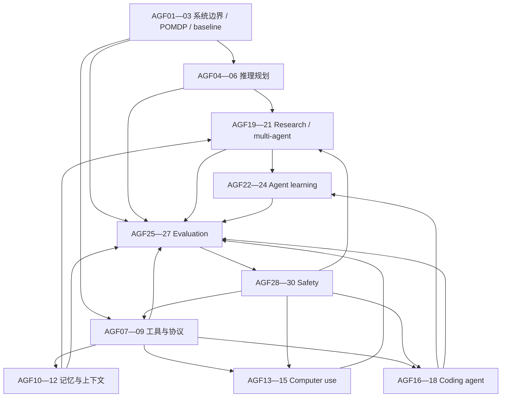

# 三年路线与 Agent 知识图谱

> 目标不是三个月“看完 Agent”，而是在一个可运行系统上逐步获得架构、实验和风险判断证据。

## 局部知识图谱



这里最重要的关系不是“第几章”，而是：**Evaluation 支撑所有能力主张；Safety 在产生外部副作用前成为阻塞前置。** 多 Agent 和 RL 都不是默认终点，它们是有实验条件的扩展。

## 16 周强化路线

默认每周 3 次、每次 45—60 分钟。若精力下降，缩小实验范围，不删除练习与证据。

| 周 | 主题 | 论文/材料 | 最小产物 | 晋级条件 |
|---|---|---|---|---|
| 1—2 | AGF01—03 系统边界 | LATS、Building Effective Agents、Agentic Automata Learning | 三种基线＋系统边界图 | 能区分 model/scaffold/environment |
| 3 | AGF04—06 规划 | LATS、Devil's Advocate、ARC-AGI-3 | 线性 vs 搜索 vs 外部验证 | 报告成功、步骤、成本和循环 |
| 4 | AGF07—09 工具 | ToolSandbox、τ-bench、MCP | 有状态工具沙箱 | 最终状态差分可确定评分 |
| 5—6 | AGF10—12 记忆 | MemGPT、Mem0、Harness the Memory | 记忆路由与冲突集 | 比较 full/sparse/dense/structured |
| 7 | AGF13—15 GUI | OSWorld、CUA、HANDBOOK.md | 可复位浏览器任务 | 危险动作有审批，规则有确定评分 |
| 8—9 | AGF16—18 Coding | SWE-bench、SWE-agent、Agentless、SWE-Lancer | coding harness 消融 | Agent 与固定流程同预算比较 |
| 10—11 | AGF19—21 Research | GAIA、BrowseComp、Deep Research、多 Agent 技术报告 | claim—evidence 账本 | 引用支持率和遗漏可审计 |
| 12—13 | AGF22—24 Learning | SICA、Agent Lightning、Agent² RL-Bench | 离线轨迹分析 | 信用分配与 held-out 回归清晰 |
| 14—15 | AGF25—27 Eval | Agent-Diff、Unified Eval、AgentJudgeBench | 可复现实验卡 | 报告方差、环境和 Judge 偏差 |
| 16 | AGF28—30 Safety | AgentDojo、系统卡、Adaptive Adversaries | 威胁模型＋红队集 | 越权/注入/循环/恢复全部过门禁 |

## 每周三次怎样安排

### 第一次：机制与论文

- 先写自己对研究问题的预测；
- 只读摘要、方法图和实验表，画出变量关系；
- 再读局限与附录，检查基线是否同预算；
- 用 200—300 字复述“作者实际证明了什么、没有证明什么”。

### 第二次：最小复现

- 固定模型、任务、预算和随机性；
- 只改变一个关键变量；
- 保存完整 trace、环境版本与失败样本；
- 不追求复现榜单绝对分，先复现方向和失败结构。

### 第三次：迁移到项目

- 把论文机制映射到一个真实功能；
- 写出是否采用、触发条件、退出条件；
- 完成一个变化任务或故障注入；
- 不看正文做费曼复述，再记录下一次复习日期。

## 学习证据模板

```text
日期 / 节点：
我能不看答案解释的机制：
本次应用或实验：
固定变量 / 改变变量：
指标、样本数与环境版本：
最关键失败样本：
这份证据支持什么，不支持什么：
评分（0—10）与具体缺口：
下一动作：
复习日期（1 / 3 / 7 / 14 / 30 天）：
```

## 怎样判断 basic 与 proficient

`basic` 至少需要：一次不看答案的准确解释、一次基础应用成功、最近相关题平均 ≥ 7/10。`proficient` 还需要：跨日期两次证据、一个变式任务、能指出常见错误与失败边界、平均 ≥ 8.5/10。收藏论文、运行 quickstart 或复制排行榜都不是掌握证据。

## 现在可以跳过什么

- 不训练底座模型时，可暂跳 PPO/GRPO 的完整推导，但不能跳奖励泄漏、信用分配和 held-out eval；
- 不做 GUI 自动化时，可暂跳坐标 grounding 细节，但工具权限和状态差分仍是通识；
- 没有可测并行子任务时，跳过多 Agent 实现；
- 没有稳定 benchmark 与回退门禁时，不做自我改写或在线 RL；
- 不要为了“前沿”同时激活 30 个节点，完整地图只负责导航。

[进入 01 · Agent 系统边界 →](/frontier/agents/01-paradigm)
